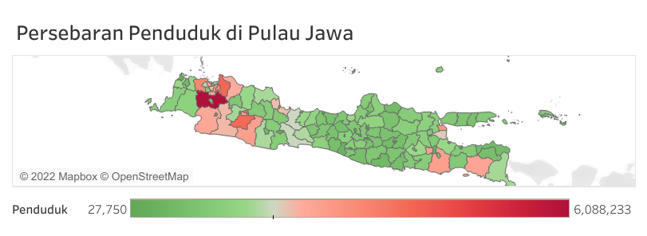
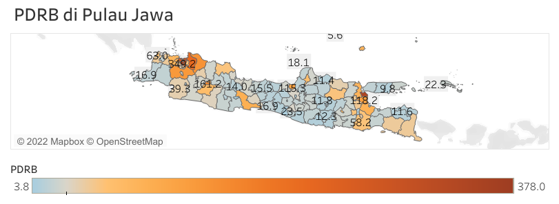

# [Project 1: Penduduk Kabupaten/ Kota di Pulau Jawa](https://github.com/rifqiazhari/indonesia/blob/main/pulau_jawa)
- Pulau Jawa merupakan pulau terpadat di dunia
- Hampir 60% penduduk Indonesia tinggal di Pulau Jawa
- Pulau Jawa terdiri dari 5 provinsi

# [Project 2: PDRB Kabupaten/ Kota di Pulau Jawa](https://github.com/rifqiazhari/indonesia/blob/main/pulau_jawa)
- Pulau Jawa merupakan pusat perekonomian Indonesia
- Jakarta selaku ibukota merupakan salah satu metropolitan terbesar di dunia

# Code in R
`#Kabupaten tanpa 'Kabupaten' Kota dengan 'Kota'` 
`jakarta2020 <- read_excel ('Jakarta.xlsx')` 
`banten2020 <- read_excel ('Banten.xlsx')` 
`jabar2020 <- read_excel ('Jawa Barat.xlsx')` 
`jatim2020 <- read_excel ('Jawa Timur.xlsx')` 
`jateng2020 <- read_excel ('Jawa Tengah.xlsx')` 
`yogya2020 <- read_excel ('Yogyakarta.xlsx')` 
 
`jakarta2020 <- jakarta2020[-c(1:2,10:13),]` 
`jakarta2020 <- jakarta2020[,c(1,3)]` 
`jabar2020 <- jabar2020[,c(1,4)]` 
`jabar2020 <- jabar2020[-c(1,30:33),]` 
`jateng2020 <- jateng2020[,c(1,3)]` 
`jateng2020 <- jateng2020[-c(1,38:41),]` 
`jatim2020 <- jatim2020[,c(1,10)]` 
`jatim2020 <- jatim2020[-c(1:2,42:45),]` 
`banten2020 <- banten2020[,c(1,9)]` 
`banten2020 <- banten2020[-c(1:2,12:15),]` 
`yogya2020 <- yogya2020[,c(1:2)]` 
`yogya2020 <- yogya2020[-c(1,8:11),]` 
 
`jakarta2020 <- jakarta2020 %>%` 
&emsp;&emsp;`setNames(c("Daerah", "Penduduk"))` 
`jateng2020 <- jateng2020 %>%` 
&emsp;&emsp;`setNames(c("Daerah", "Penduduk"))` 
`jabar2020 <- jabar2020 %>%` 
&emsp;&emsp;`setNames(c("Daerah", "Penduduk"))` 
`jatim2020 <- jatim2020 %>%` 
&emsp;&emsp;`setNames(c("Daerah", "Penduduk"))` 
`banten2020 <- banten2020 %>%` 
&emsp;&emsp;`setNames(c("Daerah", "Penduduk"))` 
`yogya2020 <- yogya2020 %>%` 
&emsp;&emsp;`setNames(c("Daerah", "Penduduk"))` 
 
`#penduduk jakarta 2268.81 ubah ke integer dan dikali 1000` 
`library(readr) --parse_number()` 
`jakarta2020$Penduduk <- jakarta2020$Penduduk %>%` 
&emsp;&emsp;`parse_number()` 
`jakarta2020 <- jakarta2020 %>%` 
&emsp;&emsp;`mutate(Penduduk = Penduduk*1000)` 
`banten2020$Penduduk <- banten2020$Penduduk %>%` 
&emsp;&emsp;`parse_number()` 
`jabar2020$Penduduk <- jabar2020$Penduduk %>%` 
&emsp;&emsp;`parse_number()` 
`jatim2020$Penduduk <- jatim2020$Penduduk %>%` 
&emsp;&emsp;`parse_number()` 
`jateng2020$Penduduk <- jateng2020$Penduduk %>%` 
&emsp;&emsp;`parse_number()` 
`yogya2020$Penduduk <- yogya2020$Penduduk %>%` 
&emsp;&emsp;`parse_number()` 
 
`#add Provinsi table` 
`yogya2020 <- yogya2020 %>%` 
&emsp;&emsp;`mutate(Provinsi = 'Yogyakarta')` 
`jabar2020 <- jabar2020 %>%` 
&emsp;&emsp;`mutate(Provinsi = 'Jawa Barat')` 
`jatim2020 <- jatim2020 %>%` 
&emsp;&emsp;`mutate(Provinsi = 'Jawa Timur')` 
`jateng2020 <- jateng2020 %>%` 
&emsp;&emsp;`mutate(Provinsi = 'Jawa Tengah')` 
`banten2020 <- banten2020 %>%` 
&emsp;&emsp;`mutate(Provinsi = 'Banten')` 
`jakarta2020 <- jakarta2020 %>%` 
&emsp;&emsp;`mutate(Provinsi = 'Jakarta Raya')` 
 
`bindrow ` 
`jawa2020 <- banten2020 %>%` 
&emsp;&emsp;`bind_rows(jakarta2020, jabar2020, jateng2020, jatim2020, yogya2020)` 
 
`#rename` 
`jawa2020$Daerah <- jawa2020$Daerah  %>%` 
&emsp;&emsp;`str_replace("Kabupaten ", "") %>%` 
&emsp;&emsp;`str_replace("Kab ", "") %>%` 
&emsp;&emsp;`str_replace("Kep", "Kepulauan") %>%` 
&emsp;&emsp;`str_replace("DKI Jakarta", "Jakarta Raya") %>%` 
&emsp;&emsp;`str_replace("D.I. ", "") %>%` 
&emsp;&emsp;`str_replace("PROVINSI JAWA TENGAH", "Jawa Tengah") %>%` 
&emsp;&emsp;`str_replace("Provinsi", "") %>%` 
&emsp;&emsp;`str_replace("Gunungkidul", "Gunung Kidul")` 
&emsp;&emsp;`str_replace("Kulonprogo", "Kulon Progo")` 
&emsp;&emsp;`str_replace("Yogyakarta", "Kota Yogyakarta")` 
 
`jawa2020 <- jawa2020[-c(120),]` 
 
`#web scraping to add pdrb data` 
https://id.wikipedia.org/wiki/Daftar_kabupaten_dan_kota_di_Indonesia_menurut_PDRB 
 
`library(rvest)` 
`g <- read_html("https://id.wikipedia.org/wiki/Daftar_kabupaten_dan_kota_di_Indonesia_menurut_PDRB")` 
`gdp2016 <- g %>%` 
&emsp;&emsp;`html_nodes("table")` 
`gdp2016 <- gdp2016[[1]]` 
`gdp2016 <- gdp2016 %>%` 
&emsp;&emsp;`html_table()` 
 
`gdp2016 <- gdp2016[,c(2:4)]` 
 
`gdp2016 <- gdp2016 %>%
&emsp;&emsp;`setNames(c("Daerah", "Provinsi", "PDRB"))` 
 

`#rename provinsi di pulau jawa` 
`gdp2016$Provinsi <- gdp2016$Provinsi %>%` 
&emsp;&emsp;`str_replace("Daerah Istimewa Yogyakarta", "Yogyakarta") %>%` 
&emsp;&emsp;`str_replace("Daerah Khusus Ibukota Jakarta", "Jakarta Raya") %>%` 
&emsp;&emsp;`str_replace("Daerah Khusus Ibu Kota Jakarta", "Jakarta Raya")` 
 

`#filter hanya provinsi di pulau jawa` 
`gdp2016 <- gdp2016 %>%` 
&emsp;&emsp;`filter(Provinsi %in% c('Jakarta Raya', 'Jawa Barat', 'Banten', 'Jawa Tengah', 'Yogyakarta', 'Jawa Timur'))` 
 

`#rename nama daerah` 
`gdp2016$Daerah <- gdp2016$Daerah  %>%` 
&emsp;&emsp;`str_replace("Kabupaten ", "") %>%` 
&emsp;&emsp;`str_replace("Kota Administrasi ", "") %>%` 
&emsp;&emsp;`str_replace("Administrasi ", "") %>%` 
&emsp;&emsp;`str_replace("Gunungkidul", "Gunung Kidul")` 
 

`#join jawa2020 & gdp2016` 
`join <- jawa2020 %>%` 
&emsp;&emsp;`inner_join(gdp2016, by = "Daerah")` 
 

`#penyesuaian dengan data shp` 
`join$Daerah <- join$Daerah %>%` 
&emsp;&emsp;`str_replace("Kota Cilegon", "Cilegon") %>%` 
&emsp;&emsp;`str_replace("Kota Tangerang Selatan", "Tangerang Selatan") %>%` 
&emsp;&emsp;`str_replace("Kota Depok", "Depok") %>%` 
&emsp;&emsp;`str_replace("Kota Cimahi", "Cimahi") %>%` 
&emsp;&emsp;`str_replace("Kota Banjar", "Banjar") %>%` 
&emsp;&emsp;`str_replace("Kota Salatiga", "Salatiga") %>%` 
&emsp;&emsp;`str_replace("Kota Surakarta", "Surakarta") %>%` 
&emsp;&emsp;`str_replace("Kota Batu", "Batu") %>%` 
&emsp;&emsp;`str_replace("Kota Surabaya", "Surabaya")` 

# Code in Python
`#Import file` 
`#Import library` 
`import pandas as pd` 
`import numpy as pd` 
`import matplotlib.pyplot as plt` 
 
`#read files` 
`data1= pd.read_excel('PDRB 2010.xlsx')` 
`data2= pd.read_excel('PDRB 2010B.xlsx')` 
`data3= pd.read_excel('PDRB 2010C.xlsx')` 
 
`#rename columns` 
`data1.rename(columns={'Provinsi': 'Provinsi', '[Seri 2010] Produk Domestik Regional Bruto (Milyar Rupiah)':'2019','Unnamed: 2':'2020', 'Unnamed: 3':'2021'}, inplace = True)` 
`data2.rename(columns={'Provinsi': 'Provinsi', '[Seri 2010] Produk Domestik Regional Bruto (Milyar Rupiah)':'2016','Unnamed: 2':'2017', 'Unnamed: 3':'2018'}, inplace = True)` 
`data3.rename(columns={'Provinsi': 'Provinsi', '[Seri 2010] Produk Domestik Regional Bruto (Milyar Rupiah)':'2013','Unnamed: 2':'2014', 'Unnamed: 3':'2015'}, inplace = True)` 
 

`#delete columns` 
`data1 = data1.drop(` 
&emsp;&emsp;`labels = ["Unnamed: 4", "Unnamed: 5", "Unnamed: 6"],` 
&emsp;&emsp;`axis = 1,` 
&emsp;&emsp;`inplace = False` 
&emsp;&emsp;`)` 
 
`data2 = data2.drop(` 
&emsp;&emsp;`labels = ["Unnamed: 4", "Unnamed: 5", "Unnamed: 6"],` 
&emsp;&emsp;`axis = 1,` 
&emsp;&emsp;`inplace = False` 
&emsp;&emsp;`)` 
 
`data3 = data3.drop(` 
&emsp;&emsp;`labels = ["Unnamed: 4", "Unnamed: 5", "Unnamed: 6"],` 
&emsp;&emsp;`axis = 1,` 
&emsp;&emsp;`inplace = False` 
&emsp;&emsp;`)` 
 

`#delete rows` 
`data3 = data3.drop(` 
&emsp;&emsp;`labels = [0,1,37,38,39,40],` 
&emsp;&emsp;`axis = 0,` 
&emsp;&emsp;`inplace = False` 
&emsp;&emsp;`)` 

`#left join` 
`data23 = pd.merge(data3,data2, on='Provinsi', how='left')` 
 
`#inner join` 
`data123 = pd.merge(data23,data1, on='Provinsi', how='inner')` 
 
`#results` 
`print(data123)` 
 
`#select only province in java island` 
`data123jawa = data123.loc[[15,10,11,12,13,14]]` 
 
`#bar chart grouped visualization` 
`x = np.arange(len(data123jawa.Provinsi))` 
`y5 = data123jawa['2017']` 
`y6 = data123jawa['2018']` 
`y7 = data123jawa['2019']` 
`y8 = data123jawa['2020']` 
`y9 = data123jawa['2021']` 
 
`width = 0.1` 
 

`fig, ax = plt.subplots()` 
`rects5 = ax.bar(x - 0.2, y5, width, label='2017')` 
`rects6 = ax.bar(x - 0.1, y6, width, label='2018')` 
`rects7 = ax.bar(x - 0.0, y7, width, label='2019')` 
`rects8 = ax.bar(x + 0.1, y8, width, label='2020')` 
`rects9 = ax.bar(x + 0.2, y9, width, label='2021')` 
 
`ax.set_ylabel('GDP')` 
`ax.set_title('GDP (Nominal) in Java Island')` 
`ax.set_xticks(x, data123jawa['Provinsi'])` 
`ax.legend()` 
 
`fig.tight_layout()` 
 
`plt.show()` 
 
`#reshaped` 
`data123jawa_reshaped = pd.melt(data123jawa, id_vars='Provinsi', value_name='GDP', var_name='year')` 
 

# Code in SQL
`#import table to the database (csv) - UI` 
 
`#rename table` 
`rename table girrafe.pdrb TO girrafe.pdrb1;` 
 
`#delete and rename columns` 
`select * from pdrb1;` 
`alter table girrafe.pdrb1 drop column `2019 Konstan`;` 
`alter table girrafe.pdrb1 drop column `2020 Konstan`;` 
`alter table girrafe.pdrb1 drop column `2021 Konstan`;` 
`alter table girrafe.pdrb1 change `2019 Berlaku` `2019` double null;` 
`alter table girrafe.pdrb1 change `2020 Berlaku` `2020` double null;` 
`alter table girrafe.pdrb1 change `2021 Berlaku` `2021` double null;` 

`select * from pdrb2;` 
`alter table girrafe.pdrb2 drop column `2016 Konstan`;` 
`alter table girrafe.pdrb2 drop column `2017 Konstan`;` 
`alter table girrafe.pdrb2 drop column `2018 Konstan`;` 
`alter table girrafe.pdrb2 change `2016 (nominal)` `2016` double null;` 
`alter table girrafe.pdrb2 change `2017 (nominal)` `2017` double null;` 
`alter table girrafe.pdrb2 change `2018 (nominal)` `2018` double null;` 
 
`select * from pdrb3;` 
`alter table girrafe.pdrb3 drop column `2013h`;` 
`alter table girrafe.pdrb3 drop column `2014i`;` 
`alter table girrafe.pdrb3 drop column `2015j`;` 
`alter table girrafe.pdrb3 change `2013 (nominal)` `2013` double null;` 
`alter table girrafe.pdrb3 change `2014 (nominal)` `2014` double null;` 
`alter table girrafe.pdrb3 change `2015 (nominal)` `2015` double null;` 
 
`#inner join` 
`create table pdrb23 (
	select pdrb3.Provinsi, `2013`, `2014`, `2015`, `2016`, `2017`, `2018` from pdrb3
	inner join pdrb2
	on pdrb3.Provinsi = pdrb2.Provinsi
);` 
 
`select * from pdrb23` 
 
`create table pdrb123 (
	select pdrb23.Provinsi, `2013`, `2014`, `2015`, `2016`, `2017`, `2018`, `2019`, `2020`, `2021` from pdrb23
	inner join pdrb1
	on pdrb23.Provinsi = pdrb1.Provinsi
);
` 
 
`#results` 
`select * from pdrb123;` 
